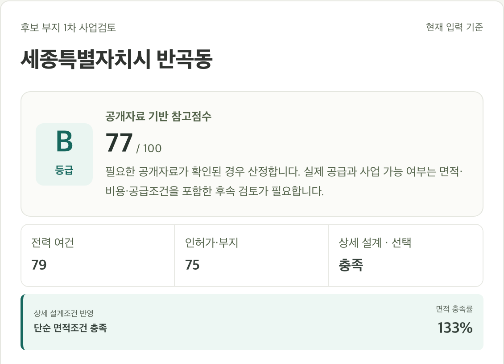

# 여기 DC 돼요?

**흩어진 부지 정보를, 검토의 근거와 다음 행동으로.**

데이터센터 개발·사업검토 담당자를 위한 지도 기반 웹서비스입니다. 주소 검색부터 전력·입지 여건 확인, 사업조건 계산, 후보 비교, 보고서 작성까지 하나의 흐름으로 연결합니다. 공개자료와 입력 조건을 함께 정리해 전문 검토와 관계기관 협의를 준비하도록 돕습니다.

[서비스 이용하기](https://grand-site-dc.vercel.app) · [예제 따라 하기](docs/EXAMPLE_INPUT.md) · [개발 환경 실행](docs/RUNNING.md)

GS그룹 PLAI CAMP S3 개발자 리그 출품 프로젝트 · 팀 **캠핑왕 랄프** · 최종 버전의 기준 브랜치 **`prototype`**

## 주요 기능

| 기능 | 활용 방법 |
|---|---|
| 지도에서 시작하는 부지 검토 | 주소·읍면동·좌표 검색 또는 지도 선택으로 전력, 용도지역, 규제·재해, 주변 여건을 확인합니다. |
| 사업조건에 따른 계산 | 연면적·대지면적·용적률·건폐율과 사업비·차입조건을 바꾸며 면적과 비용을 검토합니다. |
| 최대 네 곳의 후보 비교 | 공통 사업조건과 부지별 입력을 구분해 후보를 같은 기준으로 비교합니다. |
| 근거를 담은 검토보고서 | 요약, 18개 검토 항목, 자료 출처와 다음 확인사항을 보고서·A4 PDF로 정리합니다. |
| 선택형 AI 검토 의견 | Google AI 기반 의견으로 항목별 해석과 후속 확인사항을 보완하고, 확인한 의견을 보고서 부록에 선택적으로 포함합니다. |
| 이어서 검토하기 | 같은 탭에서 소개 페이지를 오가거나 새로고침한 뒤 입력과 후보를 이어서 검토합니다. |



화면 예시는 가상 사업조건과 검증용 조회 응답을 사용합니다. 실제 검토에서는 자료 기준일·조회 상태·입력 조건을 함께 확인합니다. 전력 공급, 인허가, 사업성의 최종 판단은 전문 검토와 관계기관 협의로 이어집니다.

## 빠른 시작

Node.js **24**와 npm을 사용합니다. 검증용 Python은 **3.12** 기준입니다.

```bash
git clone --branch prototype https://github.com/seungminyi-byte/Camp_It_Ralph.git
cd Camp_It_Ralph
npm --prefix prototype ci
npm --prefix prototype run dev -- --host 127.0.0.1 --port 5199
```

브라우저에서 `http://127.0.0.1:5199`를 엽니다. 공개자료 번들이 포함되어 있어 기본 실행을 위해 자료를 다시 수집할 필요는 없습니다.

개발 서버의 `/api/*`는 운영 API로 전달됩니다. 주소·선택 좌표와 직접 요청한 AI 생성 내용이 운영 서버에 전송되며 인터넷 연결이 필요합니다. `prototype/api/` 수정 검증과 자체 배포는 [실행 안내](docs/RUNNING.md)와 [서버 설정](docs/CONFIGURATION.md)을 따릅니다.

## 검토 흐름

1. 주소를 검색하거나 지도에서 후보를 선택합니다.
2. 전력·입지 자료와 출처, 조회 상태를 확인합니다.
3. 면적·비용·차입조건과 전력·용수·통신 협의 내용을 입력합니다.
4. 후보를 담아 최대 네 곳을 비교하고 다음 확인사항을 정리합니다.
5. 검토보고서를 열어 PDF로 저장합니다. 필요하면 AI 의견을 생성하고 검토한 뒤 부록에 포함합니다.

기본 계산·비교·보고서는 AI 생성 여부와 관계없이 사용할 수 있습니다. 입력이나 근거가 바뀌면 이전 AI 의견을 해제해 현재 조건과 일치하는 검토를 돕습니다.

## 프로젝트 구조

```text
prototype/        React·TypeScript 앱, 서버 API, 단위·브라우저 테스트
data-pack/        자료 출처, 공통 상수, 전처리·검증 스크립트
docs/             실행·설정·계산 사양·자료 출처·검증 안내
.github/workflows/ 품질 검사와 Vercel 배포
```

React · TypeScript · Vite · Leaflet · Vercel Edge Functions · Google AI

계산은 `prototype/src/scoring/engine.ts`의 `scoreSite()`에, 판단 기준과 가정은 `data-pack/curated/constants.json`에 모았습니다. 자세한 책임과 참고한 서비스는 [구조 안내](docs/ARCHITECTURE.md)에 정리했습니다.

## 검증

저장소 루트에서 실행합니다.

```bash
npm --prefix prototype run typecheck
npm --prefix prototype run lint
npm --prefix prototype test
python3 data-pack/scripts/validate_out.py
npm --prefix prototype run build
```

브라우저·접근성·PDF 검수는 [품질 확인 절차](docs/QA.md)를 따릅니다. 자동화 검사와 실제 온라인 API 확인을 구분해 기록합니다.

## 문서

| 문서 | 내용 |
|---|---|
| [실행 안내](docs/RUNNING.md) | 설치, 로컬 실행, 브라우저 테스트, 배포 확인 |
| [서버 설정](docs/CONFIGURATION.md) | Vercel 환경변수, 선택형 AI, 데이터 갱신 |
| [예제 입력](docs/EXAMPLE_INPUT.md) | 가상 사업조건과 독립 계산 기대값 |
| [계산 사양](docs/PLAN.md) | 입력·면적·비용·참고점수의 기준 |
| [데이터 출처](docs/DATA.md) | 자료 기준일, 가공 방식, 적용 범위 |
| [구조 안내](docs/ARCHITECTURE.md) | 계산·데이터·화면·API의 역할 |
| [품질 확인](docs/QA.md) | 자동 검사, 실제 화면·API·PDF 확인 |
| [AI 오류 진단](docs/AI_DIAGNOSTICS.md) | 안전한 오류 코드와 운영 확인 절차 |

지도·공개자료·외부 라이브러리에는 각각의 이용조건이 적용됩니다. 출처와 자료별 범위는 [데이터 문서](docs/DATA.md)를 확인하세요.
